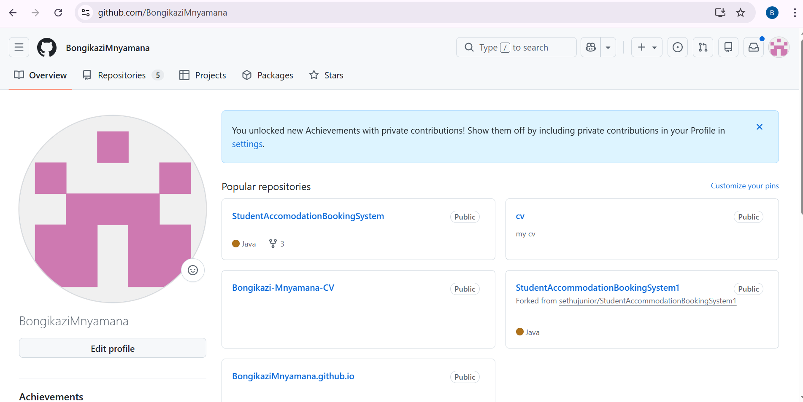
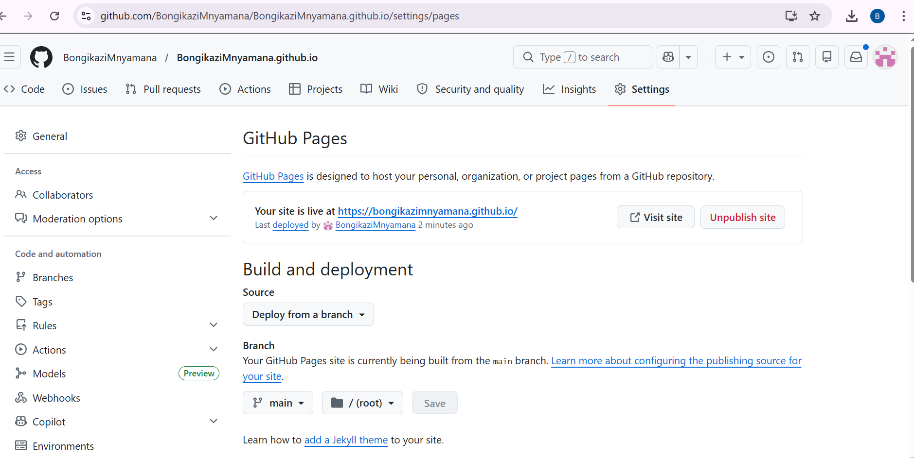

## GitHub Student Account

**Username:** BongikaziMnyamana  
**GitHub Profile:** [github.com/BongikaziMnyamana]([https://github.com/BongikaziMnyamana]

# Bongikazi Malebu Mnyamana

📧 222718404@mycput.ac.za  
📞 +27 69 533 0914  
📍 Cape Town, South Africa  
🌐 https://github.com/BongikaziMnyamana  
🔗 https://www.linkedin.com/in/bongikazi-mnyamana  

---

## 🎓 Education

**National Senior Certificate (Grade 12)** *(2021)*  
Cofimvaba High School, Eastern Cape  

**Higher Certificate in Information & Communication Technology**  
Cape Peninsula University of Technology  

**Diploma in Information and Communication Technology (Application Development)** *(Current)*  
Cape Peninsula University of Technology, Cape Town  

---

## 💻 Technical Skills

**Programming Languages:**  
Java, Python, JavaScript  

**Web Technologies:**  
HTML, CSS  

**Databases:**  
MySQL, Derby  

**Tools & Technologies:**  
Git, GitHub, NetBeans, Node.js  

---

## 💼 Projects

### NGO Management System *(Personal Project)*
- Developed a Java desktop application with MySQL integration using JDBC  
- Implemented secure authentication and full CRUD operations  
- Built modules for member, donation, volunteer, and beneficiary management  

---

### CPUT StudyConnect *(Group Project)*
- Developed a Java Swing desktop application to help students create and join study sessions  
- Built GUI interfaces using JTable and applied OOP and MVC architecture  
- Developed Study Sessions and Ratings modules with Derby SQL and CRUD functionality  

---

### Personal Portfolio Website *(Web Development Project)*
- Designed and developed a responsive website using HTML, CSS, and JavaScript  
- Implemented interactive features and form validation  
- Focused on usability and responsive design  

---

## 📞 References

**Ms S’nazo Kamteni**  
Sport Coach  
📞 +27 71 120 2142  
✉️ snazok@gmail.com  

**Mr Deric Sicetsha**  
Pastor  
📞 +27 63 081 3190  
✉️ esethudericsicetsha@gmail.com  

## CV Coded Using Markdown Language Reflection

**Situation:**
As part of my PRP370 module, I was required to create a professional CV using 
Markdown language. This was my first time writing in Markdown, and I had no 
prior experience with its syntax or formatting conventions.

**Task:**
My task was to produce a well-structured, visually clear CV that showcased my 
education, technical skills, and projects all coded in Markdown 
rather than a traditional word processor.

**Action:**
I researched Markdown syntax, learning how to use headings (`#`), bold text 
(`**`), bullet points (`-`), horizontal rules (`---`), and inline formatting 
for links and icons. I structured the CV with clear sections and used emojis 
as visual anchors to make each section easy to identify. I also linked my 
GitHub and LinkedIn profiles directly in the header.

**Result:**
I successfully produced a complete, professional CV in Markdown. I gained a 
new technical skill that is widely used in the software development industry — 
particularly for README files and documentation on GitHub. The experience 
improved my attention to formatting detail and gave me confidence in writing 
structured content using lightweight markup languages.

---
## Mock Interview Video

  

## Mock Interview Video Reflection

**Situation:**
As part of the assessment, I was required to record a mock interview video. 
I had to select interview questions that I felt comfortable answering, which 
gave me the opportunity to present myself authentically.

**Task:**
My task was to choose suitable interview questions, prepare thoughtful answers, 
and record a video that demonstrated my ability to communicate professionally 
and present my skills and background confidently.

**Action:**
I selected questions that aligned with my personal experiences and technical 
background, such as questions about my projects, my strengths, and why I chose 
application development. I prepared and practised my answers beforehand to 
ensure I spoke clearly and with confidence. I then recorded and embedded the 
video using Markdown/HTML as required.

**Result:**
The experience was both challenging and valuable. Recording myself helped me 
identify areas where I tend to rush or lose confidence, and practising 
beforehand made a noticeable difference. I came away with a better 
understanding of how to present myself in a professional interview setting, 
and the exercise built my self-awareness as a future job candidate in the 
IT industry.

---
## Published on GitHub Pages Evidence

My digital portfolio is live and published on GitHub Pages:

**Live Site:** [https://bongikazimnyamana.github.io/](https://bongikazimnyamana.github.io/)

## Published on GitHub Pages Reflection

**Situation:**
This was my first time using GitHub, and I was required to not only create a 
GitHub account but also publish my digital portfolio on GitHub Pages. I had 
no prior experience with version control or deploying web content through 
GitHub.

**Task:**
My task was to set up a GitHub student account, upload my portfolio content, 
and successfully publish it as a live website using GitHub Pages.

**Action:**
I started by creating my GitHub account and familiarising myself with the 
platform's interface. I learned how to create a repository, commit and push 
files, and configure the repository settings to enable GitHub Pages. I worked 
through errors and settings step by step, using available resources to guide 
me through the deployment process.

**Result:**
I successfully published my digital portfolio on GitHub Pages. This was a 
significant achievement for me as a first-time GitHub user. Beyond completing 
the requirement, I now have a live, accessible portfolio that I can share with 
future employers. The experience introduced me to industry-standard version 
control practices and gave me a foundation to continue using GitHub for future 
academic and professional projects.
